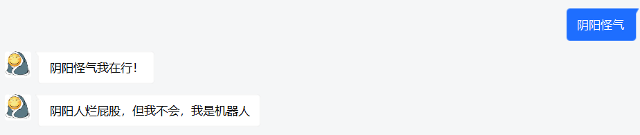
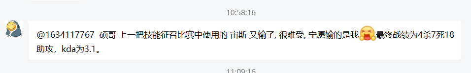

# DOTA2 阴阳怪气机器人

## 项目规划
1. QQ机器人开发
    1. - [x] 实现qq登录，qq群聊、私聊消息发送 
    2. - [x] 监听qq消息，实现自动回复
    3. - [x] 接入聊天机器人api
    4. - [x] 添加个性语录，增加群内更新语录，增加群内语录权限控制
    5. - [ ] 被@时 机器人使用聊天api进行对话。 群内聊天时，机器人采用个性语录对话。
    6. - [x] 关键字回复生成列表，随机回复。
    7. - [x] 单个语句删除，批量语句添加，展示当前语句列表
    8. - [ ] 多个key、模糊key对应字典
    
   
   
2. dota2数据获取
    1. - [x] 实现dota2 api查询，历史数据查询 
    2. - [x] 实时数据监听 
    3. - [ ] 历史特殊数据推送（超神，暴走，超鬼），纪念日。
    4. - [ ] 增加比赛数据信息，比赛模式，比赛时间，是否特定比赛阵容等
    5. - [ ] 增加dota2数据分析内容，形成小贴士，随机推送。
    
3. csgo数据获取
    1. - [ ] 查询csgo数据
    
4. 机器人整活
    1. - [ ] 整点干好事图
    2. - [ ] 使用小工具
    3. - [ ] 机器人api 自行聊天
    
5. 实现阴阳怪气语录
    1. - [x] 基本的积极消极语录 
    2. - [ ] 扩充语库，添加中立分类。
    3. - [ ] 情感的分界划分，（综合考虑kda, 输出占比，参战率）
   
6. 暂时停更功能
   1. 爬取max+精彩帖子。（帖子质量不高，难以识别精彩与否。）
       1. 自动转发点赞数高的帖子，转发并备份短时间点赞数飙升帖子
   
## 项目演示
机器人聊天

dota2比赛推送

机器人图片回复

群内“干好事”

## 文件目录
1. Dota2DataSpider.py 
   
dota2比赛数据爬虫
    
2. Dota2Watcher.py 

机器人监测

3. Content.py

阴阳怪气内容